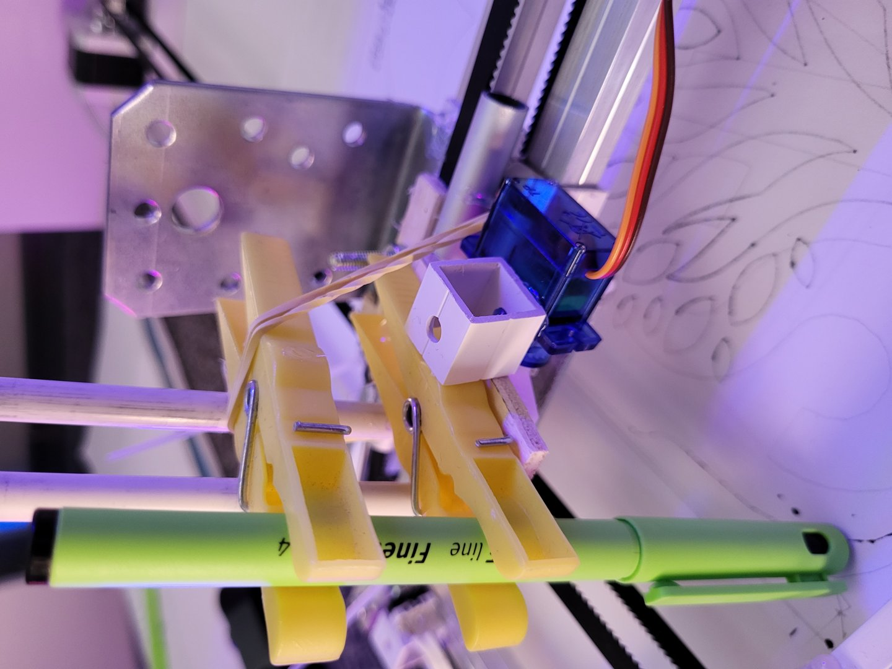
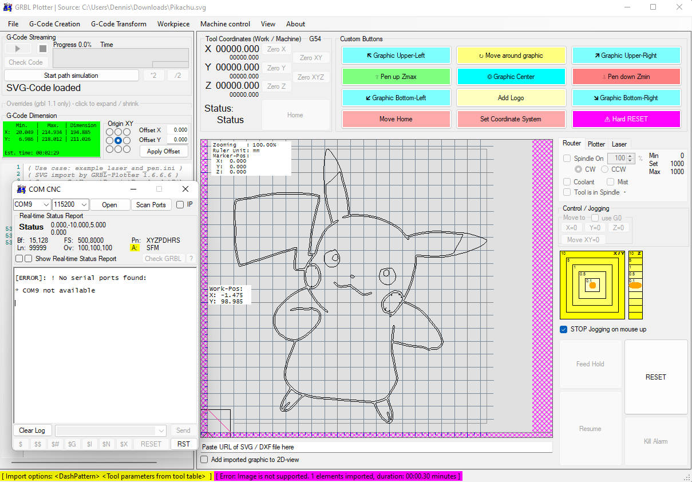

This time I managed to build a fully functional 2D-Pen-Plotter. Some would call it printer. The plotter is 50 cm^2 big and covers a printable area of 250 mm \* 250 mm.

In the following video I printed a frog:



And here a Pokémon called Evoli:



This is the construction for the pen holder:

And here is one of the motors:

The software for controlling the plotter is grbl running on an Arduino Uno and grbl-plotter on my pc, both open-source.

Materials used:

- 12 volts power supply
- USB-cables for Arduino
- Power supply adapter
- Small breadboard
- CNC-Shield for Arduino
- Arduino Uno
- Plywood panel
- 5 volts fan
- Jumper-wires and Jumper
- 3x Nema-17 stepper motors
- Timing belts
- Switches
- Metal rods and plastic rods
- Screws
- Zipties
- Glass substrate
- Servo motor
- The completion took 19 days.

Special thanks to this really old looking piece of software that saved me multiple hours of programming :)

