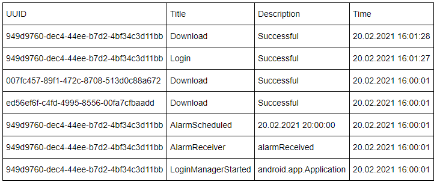
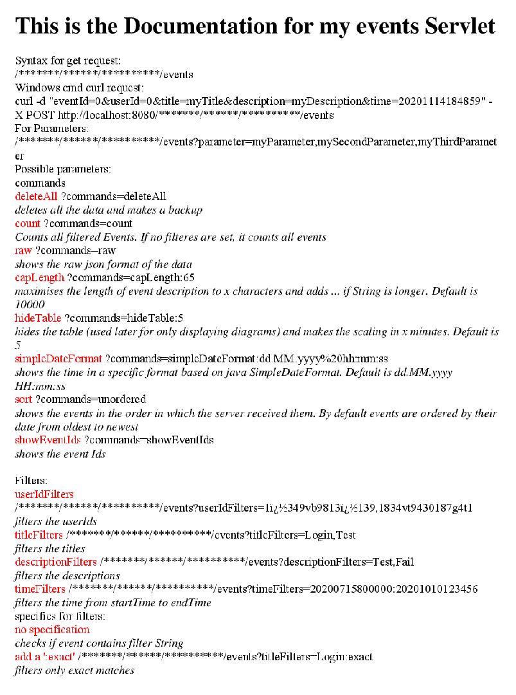
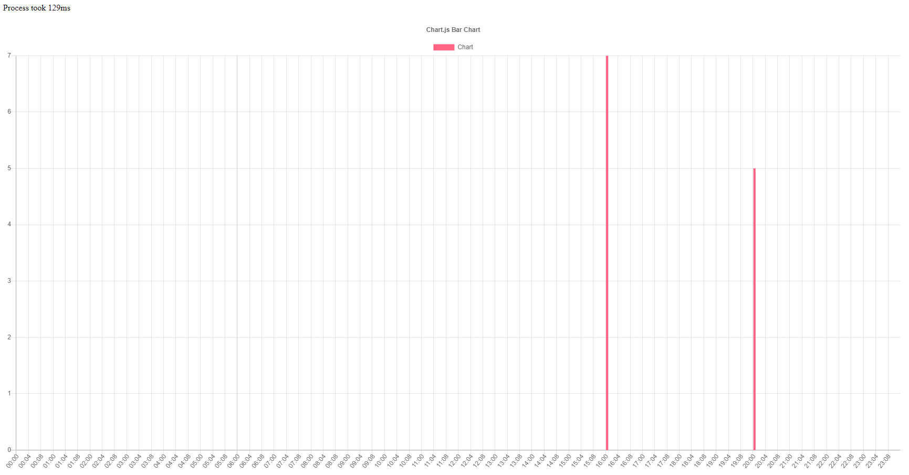

I wanted to capture events from my app users but I just didn't know what tool to use for doing that. I tried Google Analytics and Flurry Analytics which are both great tools but they are way too overkill for what I wanted to accomplish. I needed a simple tool that would capture an event with only a few parameters. The time it got sent, a title, a description and a user Id.  

My brother gave me access to a part of his server and installed apache and tomcat for me. I was then able to create and upload Java WebServlets. By sending Post- and Get-Requests to the specified Url I was able to process and store events. I used Gson to store my events as a string in a text file. Looking back at this project now there are probably thousands of ways better than the one I used but it was well enough for my purpose. Using mainly Get-Requests (it was easier to test) I used the transmitted parameters and ran different commands based on the given string.

I even wrote a documentation explaining how my servlet works (I did that because I always forgot how my commands were defined):  

That wasn't enough for me yet because I wanted to visually see, at what times my applications fails to run its script. Therefor I got myself into plotting graphs with javascript. After a while of research, it worked pretty well. Because I don't have enough data available at the moment, I can't really show what this graph would look like.  

With the request parameters I am able to change the x-axis of the chart and I can filter the content that is displayed. The y-axis shows the amount of events that were sent at a given point of the day.
