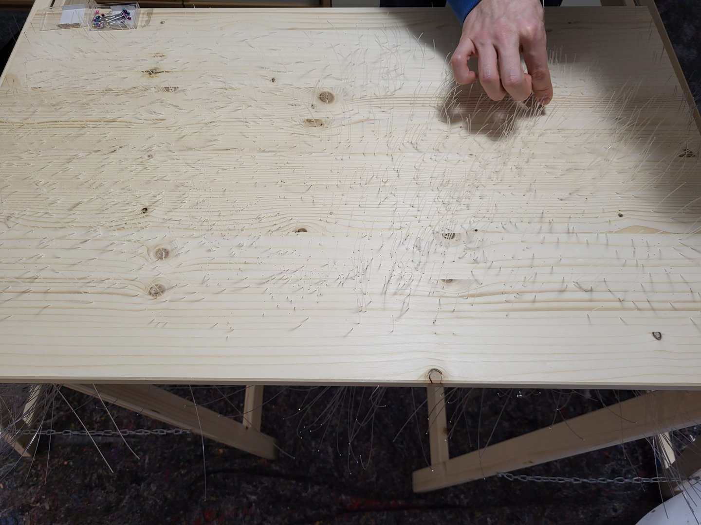

It all started with this viral video on social media:



And ended with this amazing result:



I built this table with a fiber optic light effect and touch sensors. With some help from my brother, we spent around 2.5 months and 245 hours to build this table, as well as around 1000€ for the materials and tools.

The table is made out of wood and epoxy resin. The fiber optic lights are controlled by an Esp32 microcontroller using WLED. The touch sensors are self-made PCBs.

# The PCB Design

After I saw the video, I said to my brother: "If you pay, I will build it." He agreed and we started the project.

I had some experience in PCB design from another project, so I started and finished designing the prototype on the same day.

The goal was to place around 50 to 70 of these PCBs under the table and connect long wires to each touch sensor, as well as the fiber optic lights.

After the prototype was finished, I ordered the PCBs from JLCPCB. The PCBs arrived after 2 weeks and I was very happy they worked.



The joy was of short duration, as I realized that the touch sensors had some problems when connecting more than 10 of them in series.

I still don't know why exactly the sensors stopped working after connecting 10 of them but here are my theories:

- The wires I bought from AliExpress were trash.
- The PCB design was not good because data lines and high frequency lines were too close to each other.
- The shift register used to transfer data was not suitable for this project.
- The touch sensor was too sensitive because I omitted the capacitors.

# The PCB Design V2

I did not want to give up already so I persuaded my brother to order a second version of improved PCBs with most of the problems fixed.

The new PCBs looked like this:

It was smaller, more compact, had lots of capacitors and thicker data lines. In hopes that this would fix the problems, I ordered the PCBs from JLCPCB.



They seemed to work too, but I still had to try connecting more than 10 of them in series.



I was very happy that they worked and I could finally start building the table.

# The Prototype table

Before building the big table, I wanted to try out the fiber optic lights and the touch sensors on a small scale.

For that, I built two small prototypes, one from polystyrene and one from wood.





The results were very promising and I could start building the big table. I also learned a lot about how to build the table and what not to do.

# Buying the Materials

The materials were primarily bought from a lokal hardware store. Everything I could not find there, I bought from Amazon or AliExpress.

A plan never goes as planned, so we had to drive to the hardware store multiple times to buy more materials.

| Material                                         | Supplier    | Quantity | Quantity Used | Unit   | Cost    | Currency Code |
| ------------------------------------------------ | ----------- | -------- | ------------- | ------ | ------- | ------------- |
| LED Module (Broken Prototypes)                   | JLCPCB      | 75       | 0             | Pieces | $100.83 | USD           |
| JST Cable                                        | AliExpress  | 90       | 85            | Pieces | €23.23  | EUR           |
| Fiber Optic 2m                                   | AliExpress  | 200      | 0             | Pieces | €14.46  | EUR           |
| Drill Bits 0.75-0.85 mm Various Sizes            | AliExpress  | 40       | 2             | Pieces | €6.22   | EUR           |
| USB-C Module                                     | AliExpress  | 10       | 0             | Pieces | €4.35   | EUR           |
| Respirator A1                                    | Amazon      | 1        | 0             | Pieces | €30.99  | EUR           |
| Wood Drill 1mm                                   | Amazon      | 5        | 0             | Pieces | €8.80   | EUR           |
| Drill 0.9mm                                      | Amazon      | 10       | 0             | Pieces | €5.99   | EUR           |
| Epoxy Resin                                      | Epodex      | 4.5      | 2.2           | kg     | €89.99  | EUR           |
| Silicone Wire 12 AWG                             | Amazon      | 10       | 0             | m      | €23.99  | EUR           |
| Fiber Optic 2mm                                  | Amazon      | 300      | 250           | Pieces | €29.99  | EUR           |
| Toggle Switch                                    | Amazon      | 5        | 1             | Pieces | €6.99   | EUR           |
| Epoxy Resin Color Set (16 Colors)                | Amazon      | 1        | 0             | Pieces | €11.99  | EUR           |
| Batten Spruce/Fir                                | Obi         | 3        | 3             | m      | €2.55   | EUR           |
| Laminated Wood Spruce 50x80                      | Obi         | 1        | 1             | Pieces | €21.59  | EUR           |
| Folding Sawhorse Pinewood                        | Obi         | 2        | 2             | Pieces | €13.98  | EUR           |
| Round Tube Matte Black Plastic 10mm x 100cm      | Obi         | 3        | 1             | Pieces | €8.07   | EUR           |
| Silicone                                         | Obi         | 1        | 0.2           | Pieces | €3.69   | EUR           |
| Construction Bucket                              | Obi         | 3        | 2             | Pieces | €4.17   | EUR           |
| Orbital Sander                                   | Obi         | 1        | 1             | Pieces | €54.99  | EUR           |
| Non-woven Velcro Sanding Discs 320-1500          | Obi         | 1        | 0.1           | Pieces | €9.99   | EUR           |
| Black Spray Paint                                | Obi         | 1        | 0             | Pieces | €9.99   | EUR           |
| Glass Scraper                                    | Obi         | 1        | 0             | Pieces | €5.99   | EUR           |
| Velcro Sanding Discs 80-240                      | Obi         | 1        | 0.2           | Pieces | €4.49   | EUR           |
| Wooden Stir Stick                                | Obi         | 1        | 1             | Pieces | €1.49   | EUR           |
| Disposable Coverall                              | Obi         | 1        | 0             | Pieces | €6.99   | EUR           |
| Paint Mixer                                      | Obi         | 1        | 1             | Pieces | €8.99   | EUR           |
| Epoxy Resin Separation Tape                      | Epodex      | 1        | 0.1           | Pieces | €13.99  | EUR           |
| Epoxy Resin Polish                               | Epodex      | 1        | 0.1           | Pieces | €10.99  | EUR           |
| Epoxy Resin Drop-in Dye Black                    | Epodex      | 3        | 0.1           | Pieces | €17.99  | EUR           |
| Polishing Bonnet Lambswool                       | Amazon      | 1        | 0.2           | Pieces | €6.03   | EUR           |
| Table "Lack" Black                               | Ikea        | 1        | 0             | Pieces | €9.99   | EUR           |
| Velcro Sandpaper Grit 400-3000                   | Amazon      | 1        | 0.1           | Pieces | €18.99  | EUR           |
| Sanding Discs 40-240                             | Obi         | 1        | 0.2           | Pieces | €10.99  | EUR           |
| Sanding Discs 320                                | Obi         | 1        | 0.2           | Pieces | €2.99   | EUR           |
| Heat Shrink Tubing Set 1.6-8.4mm 3:1 Transparent | Reichelt    | 1        | 0.1           | Pieces | €14.70  | EUR           |
| Batten Spruce 46x46x100                          | Globus      | 2        | 2             | Pieces | €23.38  | EUR           |
| Batten Spruce 96x19x100                          | Globus      | 3        | 3             | Pieces | €24.81  | EUR           |
| PU Parquet Varnish Water-based                   | Globus      | 1        | 0             | Pieces | €17.99  | EUR           |
| Black Lacquer                                    | Globus      | 375      | 0.2           | ml     | €9.99   | EUR           |
| Hobby Glass Plexiglass 50x100x0.2                | Globus      | 1        | 1             | Pieces | €15.39  | EUR           |
| LED Module                                       | JLCPCB      | 150      | 85            | Pieces | $200.00 | USD           |
| LED Driver Module                                | JLCPCB      | 5        | 1             | Pieces | $43.59  | USD           |
| LED Module VAT                                   | DHL Express | 1        | 1             | Pieces | €57.17  | EUR           |

# The Table Design

Before building such a table, you need to have a plan. I asked my brother what kind of design he wanted and we came up with the idea to use the star map of the day he was born as a pattern.

# Building The Table

After printing the star map, we started to drill holes in the wood for each star.



After drilling about 2000 holes, we had to insert the same amount of fiber optic lights into the holes.

Each fiber had to be glued into the hole with some hot glue to prevent leaking of the epoxy resin in a later step.

After building a frame for the table, we added the first very thin layer of epoxy resin to close any holes and prevent the resin from leaking.

The next step was to pour the rest of the epoxy resin into the table and let it cure for a few days.

Before sanding the table, we had to remove the excess fiber optic lights.

We had to do a lot of sanding afterwards to remove the excess epoxy resin touching the fibers.



The last step for the table to work for the first time was to connect the sensors.

And build a frame for the table.

# The Final Result

In the end, it was definitely worth the effort. The table looks amazing.



# Debugging, Bugs and Problems

There were a lot of problems during the building process and I did not include all details in this blog post. Here are some of the problems I encountered:

- Removing the table frame after the epoxy resin was cured was very difficult and I had to use a lot of force.
- The sensors were very sensitive and some of them started flickering at random times and I did not figure out why.
- The epoxy stopped shining after sanding and polishing it. There were lots of bubbles in the epoxy and I did not do a good job sanding it.
- And many more...

Thanks for reading!

---

# Update

I also built a second table a while later with a different pattern:



For this table I improved the PCB design again and used a different type of cable for connecting the sensors in series which worked much better.
