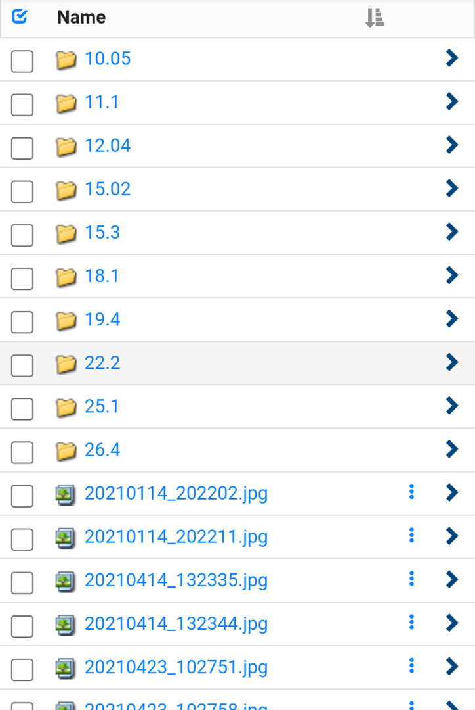
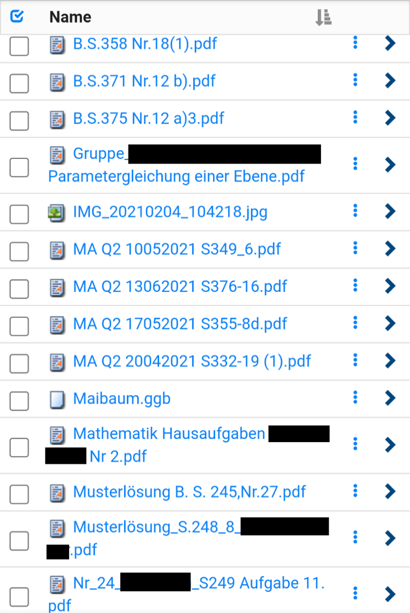
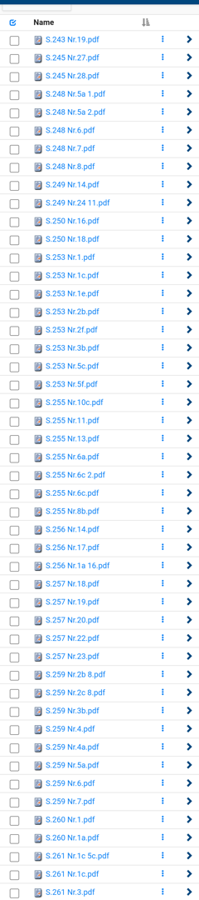

# IServ Filename Manager

It always amazes me when I look back at the projects I made.

This post will be about my IServ filename manager.

During Corona all students had to work from home. Via IServ, our online school server, we received exercises to complete and were supposed to upload our results.

One teacher took these exercises very seriously and corrected every single one for us to upload into a group folder.

The result was that we had a group folder with all kinds of files scattered.

Every student was supposed to upload his results himself, so there was no naming convention and no convention for which file type to use.

Most students uploaded PDF-files as requested by our teacher, but not everyone is technically gifted enough to know how to convert pictures taken with a phone into PDFs.

We were only organized enough to sort exercises by the date we got them, though that wasn’t helpful at all because any file system saves the date of the upload anyways.

Here is a picture of what the folder looked like (I had to hide all the personal information):




I am German by the way.

Nobody was able to find the exercises of others because the names were totally random.

My goal was to create a naming convention and automatically rename all files that get uploaded.

I started by figuring out how to download and upload files with python and mechanize.

First step was to log into the IServ website by filling and submitting a form with mechanize as well as some basic functions for loading JSON from a URL:

```python
import mechanize
import json
import FileSorterNew
import magic
import urllib
import sys

iserv = "https://**************/iserv/"
jsonUrl = "file.json/"

usrField = "_username"
pwField = "_password"
rememberMe = "_remember_me"
username = "**************"
password = open("/**********/ISERV_PWD", "r").read().replace("\n", "")

class Browser:
    def __init__(self):
        self.browser = mechanize.Browser()
        self.login()

    def login(self):
        self.browser.open(iserv)
        self.browser.select_form(nr=0)
        self.browser.form[usrField] = username
        self.browser.form[pwField] = password
        self.browser.submit()

    def jsonify(self, response):
        return json.loads(str(response.read()).replace("'", "").replace("\\n", "\n").replace("\\\\", "\\")[1:])
```

After that I defined some methods to get the folder structure from IServ and download, upload and delete files and folders.

```python
    def get_folder_from_folder_id(self, folder_id, indent = 0):
        indent_string = get_indent_string(indent)
        print(indent_string, end="")
        response = self.browser.open(iserv + jsonUrl + folder_id)
        response_json = self.jsonify(response)
        return Folder(response_json, indent)

    def get_all_files_in_folder(self, folder_root_id, indent = 0):
        folder_root = self.get_folder_from_folder_id(folder_root_id, indent)
        indent += 1
        for folder_mask in folder_root.folder_masks:
            folder = self.get_all_files_in_folder(folder_mask.id, indent)
            folder_root.add_folder(folder)
        return folder_root

    def download_file(self, download_link, filepath):
        self.browser.retrieve(download_link, filepath)

    def upload_file(self, path, upload_folder_id, filename):
        print()
        print("uploading file", filename, upload_folder_id)
        mime_type = str(magic.from_file(path, mime=True))
        self.browser.open("https://**************/iserv/file.html/" + upload_folder_id)
        self.browser.select_form(name="upload")
        self.browser.form.add_file(open(path, "rb"), mime_type, filename)
        self.browser.submit()

    def delete_file(self, folder_id, file_id):
        print("Deleting file", file_id, "in", folder_id)
        self.browser.open("https://**************/iserv/file.html/" + folder_id)
        self.browser.select_form(name="form")
        form = self.browser.form
        data = {
            "form[files][]": file_id,
            "form[path]": str(form["form[path]"]),
            "form[confirm]" : "1",
            "form[action]": "delete",
            "form[actions][confirm]": "",
            "form[_token]": str(form["form[_token]"])
            }
        data = urllib.parse.urlencode(data)
        self.browser.open("https://**************/iserv/file_multiaction", data=data)

    def create_folder(self, parent_folder_id, folder_title):
        """
        Returns a folder mask, which is basically a folder but without its children
        """
        print("Creating folder", folder_title, "in", parent_folder_id)
        self.browser.open("https://**************/iserv/file_add/folder")
        self.browser.select_form(name="file_factory")
        form = self.browser.form
        file_factory_token = form["file_factory[_token]"]
        data = urllib.parse.urlencode({
            "file_factory[item][name]": folder_title,
            "file_factory[path]": parent_folder_id,
            "file_factory[_token]": file_factory_token,
            "file_factory[submit]": ""
            })
        self.browser.open("https://**************/iserv/file_add/folder", data=data)
        for folder_mask in self.get_folder_from_folder_id(parent_folder_id).folder_masks:
            if folder_mask.title == folder_title:
                return folder_mask
        print("ERROR while creating folder!")
```

Next step was to create a data structure to make accessing and searching through folders and files easier:

```python
class Folder:
    def __init__(self, response_json, indent=0):
        self.id = str(response_json["breadcrumbs"][-1]["url"]).split("/")[-1]
        self.title = response_json["breadcrumbs"][-1]["name"]
        print(self.title)
        folder_json = response_json["data"]
        self.folders = []
        self.folder_masks = []
        self.files = []
        for obj_json in folder_json:
            self.add_obj(obj_json, self.id, indent+1)

    def add_folder(self, folder):
        self.folders.append(folder)

    def add_obj(self, obj_json, parent_folder_id, indent=0):
        obj_type = obj_json["type"]["id"]
        if obj_type == "Folder":
            self.folder_masks.append(FolderMask(obj_json))
            return
        if obj_type == "File":
            self.files.append(File(obj_json, parent_folder_id, indent))
            return

    def get_all_files_recursively(self):
        all_files = []
        all_files += self.files
        for folder in self.folders:
            all_files += folder.get_all_files_recursively()
        return all_files

class File:
    def __init__(self, file_json, parent_folder_id, indent=0):
        indent_string = get_indent_string(indent)
        self.parent_folder_id = parent_folder_id
        self.name = file_json["name"]["text"]
        self.filetype = self.name.split(".")[-1]
        self.original_name = self.get_title_without_type(self.name)
        self.set_standardized_name()
        self.id = file_json["id"]
        print(indent_string + self.original_name + "." + self.filetype)
        self.owner = file_json["owner"]
        self.date = file_json["date"]["order"]
        self.download_link = self._set_download_link(file_json)
        self.size = file_json["size"]["order"]

    def _set_download_link(self, file_json):
        link = file_json["name"]["link"]
        downloadLink = iserv + str(link).replace("/iserv/file_pass", "fs/download/local")
        return downloadLink

    def set_standardized_name(self):
        self.name = FileSorterNew.get_standarized_filename(self.name)
        self.name = self.name.split("/")[-1]
        self.name = self.get_title_without_type(self.name)

    def get_title_without_type(self, old_title):
        filetype = old_title.split(".")[-1]
        return old_title.replace("." + filetype, "")

class FolderMask:
    def __init__(self, folder_json):
        self.id = folder_json["id"]
        self.title = folder_json["name"]["text"]
```

That would be it for the IServ.py module I created.

The interesting part now is the renaming of the files.

Example:

Musterlösung B. S. 245,Nr.27.pdf

There are three important types of information in this file:

the type (.pdf) which is the easiest one to find
the number of the page (245) indicated here by B. S.
the number of the exercise (27) indicated by Nr.
Other students might choose different names for their uploads:

322-2c–323-11.jpg

This time the file includes multiple exercises.

type: .jpg
exercise 1: page 322 nr. 2c
exercise 2: page 323 nr. 11
I outsourced the job to create a renaming algorithm to a classmate, and he came up with the following:

```python
# imports:
import re

pageFileNameDelimeter = "___"

# functions:
def get_standarized_filename(filePath, debug=False):
  # outputs a file path which follows guidelines
  # from original file name

  # constants
  imgFileExt = ["png", "jpg", "jpeg"]

  # input variables
  filename = filePath.split("/")[-1]
  date = filename.split("___")[0]
  oldNameAndType = filename.split("___")[-1]
  oldType = oldNameAndType.rsplit('.', 1)[-1]
  oldName = oldNameAndType.rsplit('.', 1)[0]

  # exclude dates
  oldName = re.sub("[0-9][0-9][.][0-9][0-9][.][0-9][0-9]", "", oldName)
  oldName = re.sub("[0-9][0-9][.][0-9]?[0-9]", "", oldName)
  oldName = re.sub("[0-9][0-9][0-9][0-9][0-9][0-9][0-9][0-9]", "", oldName)

  # exclude semester indicators
  oldName = re.sub("Q[1-4]", "", oldName)

  # exclude Nr abbreviation
  oldName = re.sub("Nr", "", oldName)

  # exclude ver abbreviation
  oldName = re.sub("ver[0-9]", "", oldName)

  def pageIter():
    return re.finditer("[^0-9]?[0-9][0-9][0-9][^0-9]?", oldName)
  # pageIter = re.finditer("[^0-9]?[0-9][0-9][0-9][^0-9]?", oldName)
  pages = [re.sub("[^0-9]", "", page.group()) for page in pageIter()]

  # exclude numbers too large
  if re.findall("[0-9][0-9][0-9][0-9][0-9]?[0-9]?[0-9]?[0-9]?[0-9]?[0-9]?", oldName):
    pages = []
  oldName = re.sub("[0-9][0-9][0-9][0-9][0-9]?[0-9]?[0-9]?[0-9]?[0-9]?[0-9]?", "", oldName)

  # exclude photo file names assigned by camera
  if len(pages) > 2 and oldType in imgFileExt:
    pages = []

  if debug:
    print(pages)
    print(oldName)
    print(filePath)

  taskIter = []
  if len(pages) == 1:
    taskIter.append(re.finditer("[^0-9]?[0-9]?[0-9][a-z]?[a-z]?[a-z]?[^0-9a-z]?", oldName.replace(pages[0], "")))
    tasks = [[task.group() for task in page] for page in taskIter]
    tasks = [[re.sub("[^0-9a-z]", "", task) for task in page] for page in tasks]
  elif pages:
    try:
      for i in range(len(pages)):
        taskIter.append(re.finditer("[^0-9]?[0-9]?[0-9][a-z]?[a-z]?[a-z]?[^0-9a-z]?", oldName[[x for x in pageIter()][i].end()-1:[x for x in pageIter()][i+1].start()]))

        if debug:
          print(oldName[[x for x in pageIter()][i].end()-1:[x for x in pageIter()][i+1].start()])

    except IndexError:
      taskIter.append(re.finditer("[^0-9]?[0-9]?[0-9][a-z]?[a-z]?[a-z]?[^0-9a-z]?", oldName[[x for x in pageIter()][-1].end()-1:]))

    tasks = [[task.group() for task in page] for page in taskIter]
    tasks = [[re.sub("[^0-9a-z]", "", task) for task in page] for page in tasks]
    for page in tasks:
      for task in page:
        if task[:1] == "r":
          task = task[1:]
  else:
    tasks = []

  if debug:
    print(tasks)
    print()

  # return val
  retVal = ""
  if not pages:
    retVal = "unbekannt_" + oldNameAndType
  else:
    for page in range(len(pages)):
      retVal = retVal + "S." + pages[page]
      for task in range(len(tasks[page])):
        if tasks[page]:
          if task == 0:
            retVal = retVal + " Nr."
          retVal = retVal + tasks[page][task] + " "
        else:
          retVal = retVal + " "
      if page != len(pages)-1:
        retVal = retVal[:-1] + pageFileNameDelimeter

    retVal = retVal[:-1] + "." + oldType

  return retVal
```

Using RegEx in python he went through the string of the filename (that I will later pass into his function) and removed unnecessary parts such as dates and names, filtered out pages and numbers and returned a uniformed string that would be easier to process.

Every file that couldn’t be matched to an exercise got the tag unbekannt\_ which is German for unknown.

The resulting filenames looked like this:



It is still not perfect, but as good as a human would be able to do it.

The last part was to combine everything I talked about into a working python script that would be run on my Raspberry Pi every day.

```python
import os
import IServ
import UploadGroupIds as UGI
from Progressbar import print_progress
import FileSorterNew
from PIL import Image

def create_dir(name):
    try:
        os.mkdir(name)
    except:
        pass
def create_file(name):
    if not os.path.exists(name):
        os.mknod(name)


rootName = os.path.dirname(os.path.realpath(__file__)) + "/"

files_path = rootName + "files/"
files_backup_path = rootName + "backup/"
files_illegal_path = rootName + "illegal/"
create_dir(files_path)
create_dir(files_backup_path)
create_dir(files_illegal_path)

download_journal_filepath = rootName + "download.journal"
upload_journal_filepath = rootName + "upload.journal"
converted_journal_filepath = rootName + "converted.journal"
create_file(download_journal_filepath)
create_file(upload_journal_filepath)
create_file(converted_journal_filepath)

def get_root_folders(iserv_browser):
    global download_folder_root, geometrie_folder_root, stochastik_folder_root, nicht_zugeordnet_folder_root
    matheFolderRoot = iserv_browser.get_all_files_in_folder(UGI.MATHE_FOLDER_ROOT_ID)
    for folder in matheFolderRoot.folders:
        if UGI.DOWNLOAD_FOLDER_KEYWORD in str(folder.title):
            download_folder_root = folder
        if UGI.GEOMETRIE_FOLDER_KEYWORD in str(folder.title):
            geometrie_folder_root = folder
        if UGI.STOCHASTIK_FOLDER_KEYWORD in str(folder.title):
            stochastik_folder_root = folder
        if UGI.NICHT_ZUGEORDNET_FOLDER_KEYWORD in str(folder.title):
            nicht_zugeordnet_folder_root = folder


def add_to_download_journal(filename):
    with open(download_journal_filepath, "r+") as journal:
        if not filename in journal.read():
            journal.write(filename + "\n")
def add_to_upload_journal(filename):
    with open(upload_journal_filepath, "r+") as journal:
        if not filename in journal.read():
            journal.write(filename + "\n")
def add_to_converted_journal(filename):
    with open(converted_journal_filepath, "r+") as journal:
        if not filename in journal.read():
            journal.write(filename + "\n")

def download_content(folder, skip_names=[]):
    download_progress = 0
    files_in_folder = folder.get_all_files_recursively()
    download_count = len(files_in_folder)
    for file in files_in_folder:
        download_progress += 1
        should_skip_title = False
        for skip_name in skip_names:
            if file.name in skip_name or skip_name in file.name:
                should_skip_title = True
                break
        if not should_skip_title:
            print (file.name)
            add_to_download_journal(file.original_name + "." + file.filetype)
            print_progress(download_progress, download_count, "Download")
            iserv_browser.download_file(file.download_link, files_path + file.name + "." + file.filetype)
        else:
            print_progress(download_progress, download_count, "Skip")

def convert_file_to_pdf(filepath):
    filetype = filepath.split(".")[-1]
    add_to_converted_journal(filepath.split("/")[-1])
    image = Image.open(filepath).convert("RGB")
    image.save(filepath.replace("." + filetype, ".pdf"))
    delete_file_from_path(filepath)

def convert_downloaded_files_to_pdf():
    progress = 0
    files_count = len(os.listdir(files_path))
    for filename in os.listdir(files_path):
        progress += 1
        filepath = files_path + filename
        if filename.endswith(".pdf"):
            continue
        else:
            try:
                convert_file_to_pdf(filepath)
            except Exception as e:
                add_to_converted_journal("FAIL")
                print(e)
        print_progress(progress, files_count, "Convert")


def upload_file(path, group_id, new_name = None):
    filename = path.split("/")[-1] if new_name is None else new_name
    iserv_browser.upload_file(path, group_id, filename)
    add_to_upload_journal(path.split("/")[-1])

def delete_file_from_path(filepath):
    os.replace(filepath, files_backup_path + filepath.split("/")[-1])

def upload_from_files():
    progress = 0
    files_count = len(os.listdir(files_path))
    for filename in os.listdir(files_path):
        progress += 1
        filetype = filename.split(".")[-1]
        filepath = files_path + filename
        filename = filename.replace("." + filetype, "")
        if "unbekannt" in filename:
            upload_file(filepath, nicht_zugeordnet_folder_root.id)
        else:
            try:
                for splitName in filename.split(FileSorterNew.pageFileNameDelimeter):
                    pageNumberString = splitName[2:5]
                    try:
                        pageNumber = int(pageNumberString)
                    except:
                        pageNumber = 0
                    uploadGroup = nicht_zugeordnet_folder_root.id
                    if pageNumber > 198 and pageNumber < 321:
                        uploadGroup = geometrie_folder_root.id
                    elif pageNumber > 320 and pageNumber < 449:
                        uploadGroup = stochastik_folder_root.id

                    upload_file(filepath, uploadGroup, splitName + "." + filetype)
            except:
                upload_file(filepath, nicht_zugeordnet_folder_root.id)
        print_progress(progress, files_count, "Upload")
        delete_file_from_path(filepath)


def get_illegal_files(folder_root):
    illegal_files = []
    print("Checking for illegal files in:", folder_root.title)
    progress = 0
    files = folder_root.get_all_files_recursively()
    file_count = len(files)
    download_folder_root_files = get_uploaded_filenames(download_folder_root)
    for file in files:
        progress += 1
        print_progress(progress, file_count)
        is_file_illegal = True
        for uploaded_filename in download_folder_root_files:
            if file.name in uploaded_filename or uploaded_filename in file.name:
                is_file_illegal = False
                break
        if is_file_illegal:
            iserv_browser.download_file(file.download_link, files_illegal_path + file.original_name + "." + file.filetype)
            print("Found illegal file:", file.original_name + "." + file.filetype)
            illegal_files.append(file)
    return illegal_files

def upload_illegal_files():
    for filename in os.listdir(files_illegal_path):
        filepath = files_illegal_path + filename
        print("uploading illegal file", filepath)
        upload_file(filepath, download_folder_root.id)
        os.replace(filepath, files_backup_path + filepath.split("/")[-1])

def get_uploaded_filenames(folder_root):
    uploaded_filenames = []
    for file in folder_root.get_all_files_recursively():
        uploaded_filenames.append(file.name)
    return uploaded_filenames


def get_all_uploaded_filenames():
    uploaded_filenames = []
    uploaded_filenames += get_uploaded_filenames(geometrie_folder_root)
    uploaded_filenames += get_uploaded_filenames(stochastik_folder_root)
    uploaded_filenames += get_uploaded_filenames(nicht_zugeordnet_folder_root)
    return uploaded_filenames
def get_all_illegal_files():
    illegal_files = []
    illegal_files += get_illegal_files(geometrie_folder_root)
    illegal_files += get_illegal_files(stochastik_folder_root)
    illegal_files += get_illegal_files(nicht_zugeordnet_folder_root)
    return illegal_files

iserv_browser = IServ.Browser()
get_root_folders(iserv_browser)
uploaded_filenames = get_all_uploaded_filenames()

download_content(download_folder_root, skip_names=uploaded_filenames)
convert_downloaded_files_to_pdf()
upload_from_files()

illegal_files = get_all_illegal_files()
upload_illegal_files()

for file in illegal_files:
    iserv_browser.delete_file(file.parent_folder_id, file.id)
```

I connect to the IServ.

Then I open the root folder and look for the folder where all the exercises are uploaded.

After that I download any new files (files that aren’t stored in the files-directory or in the file journals)

I look through the files that I already uploaded another time and skip these when downloading.

When working with deleting and renaming files there is always the risk that something goes wrong and files get corrupted or lost.

To prevent that from happening I don’t touch the folder at all and just download the files. I then upload the renamed files into a new folder I created.

Illegal files are files that people illegally upload into my sorted folder. Telling my classmates to not touch my sorted folder wasn’t enough and as I don’t have permissions to make the folder read only, there were always people who’d upload their garbage into my folder.

The illegal files are downloaded, renamed and get uploaded into the original folder. The folder where all exercises should go. Then the illegal files are deleted from my folder.

In the next iteration of my script I would find these files in the root folder and transfer them back into the sorted folders. Though this time the names would be correct.

Another thing I built in was an automated way to convert all files into PDFs. Not every device is able to open images. Especially when it comes to some types such as .heic.

I use PIL to convert all images into a PDF before uploading them into my sorted folders.

This project taught me how to make get and post requests in general.

I learned how application forms work and how to work on a project together with another person.

I learned how to optimize a process as the speed of my script was gradually increased by not downloading all files every time but remembering which files I already renamed and sorted.

And I learned about the danger of transmitting and changing data via script. Luckily nothing went wrong, and I made backups all the time.
