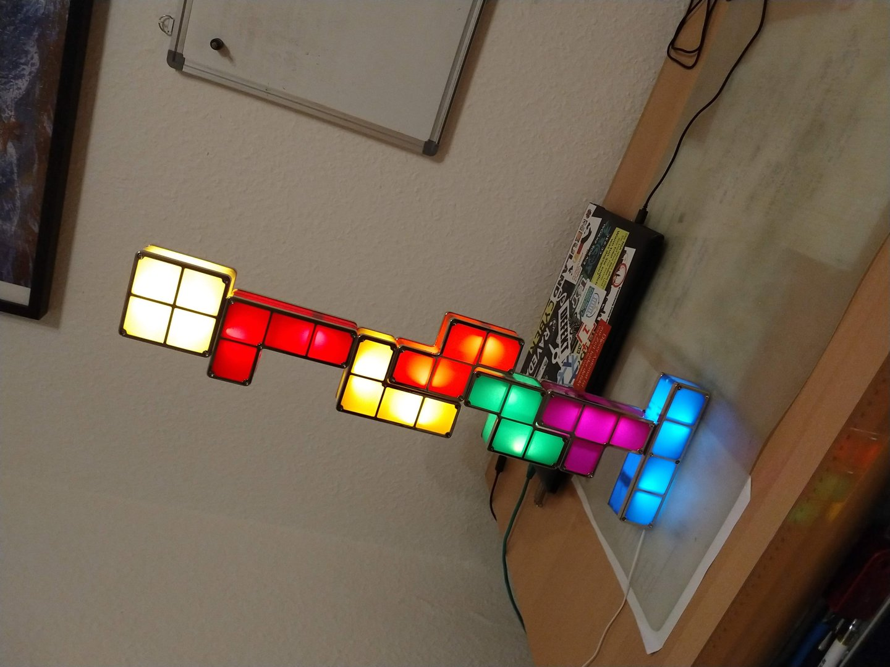
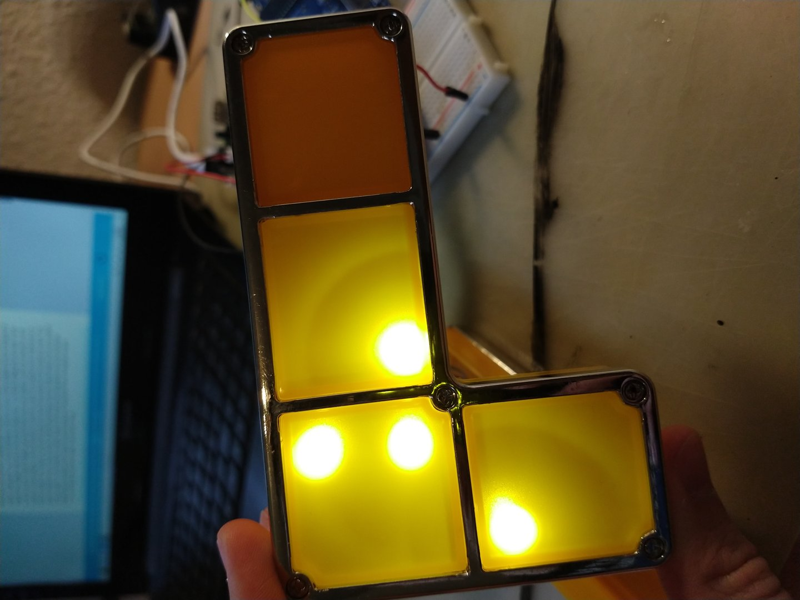
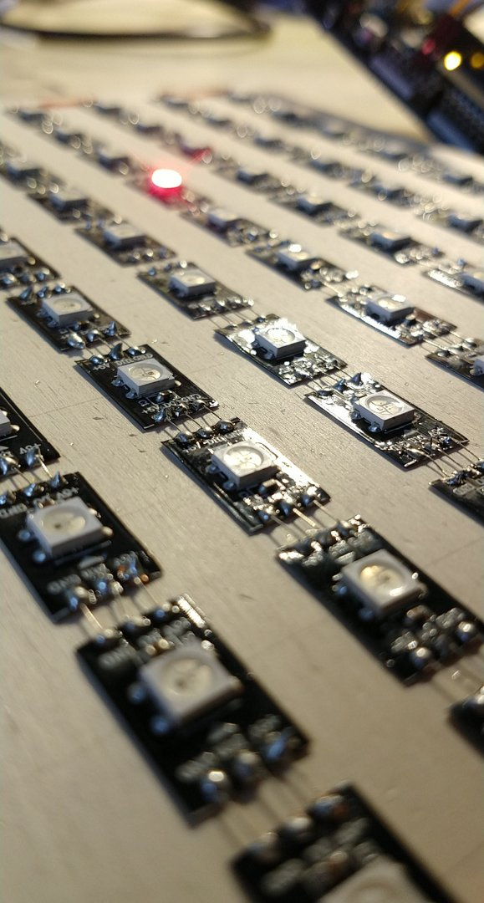
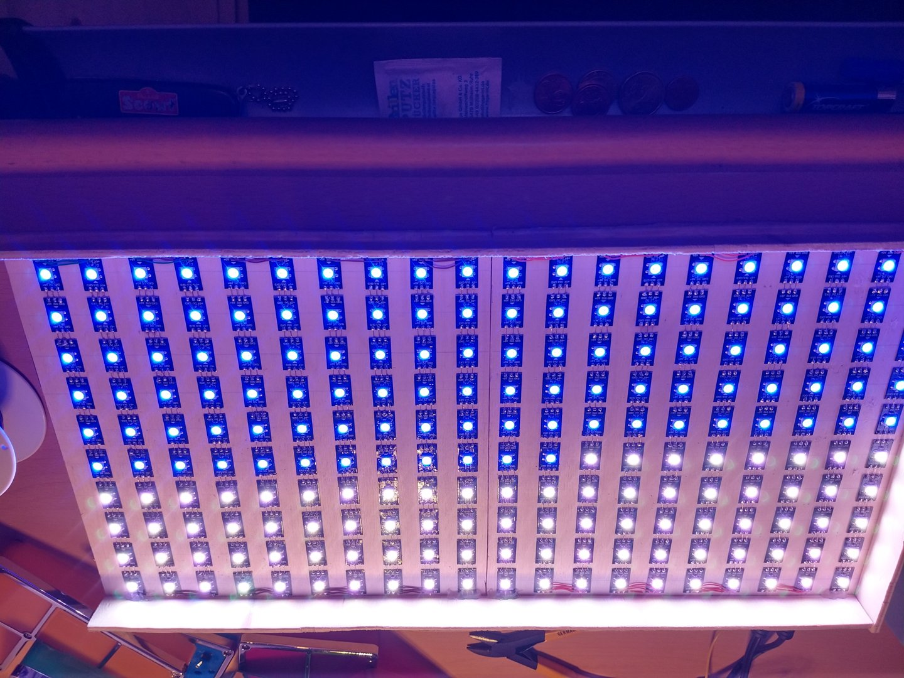
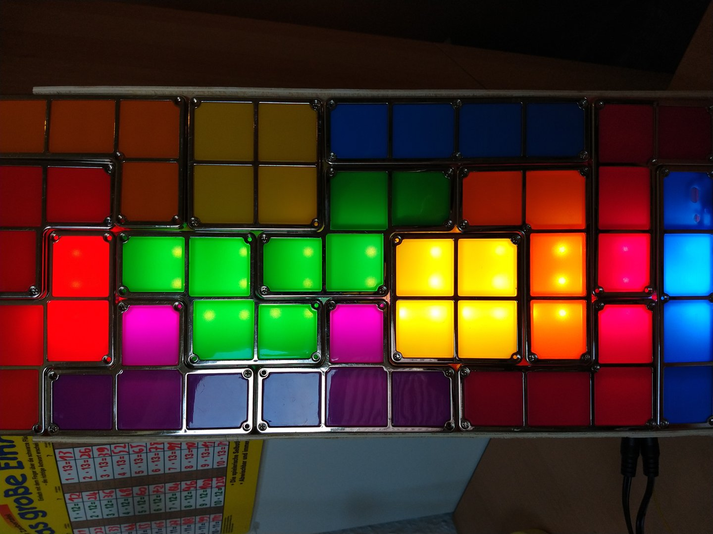
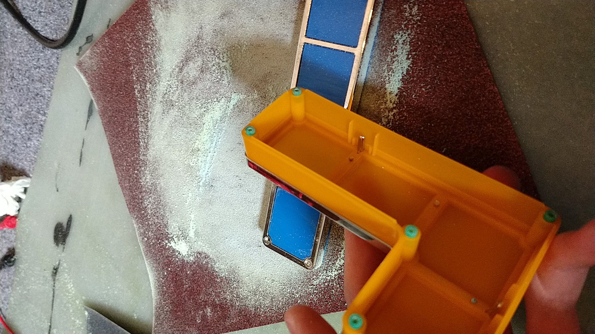
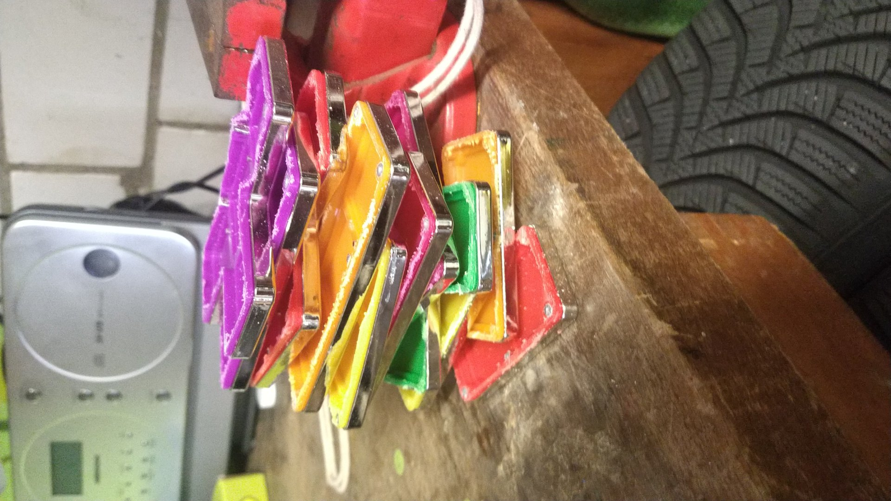

# LED Tetris

This project took me over two months to complete. I created the widely known Tetris game with an Arduino Uno, some plywood panels, an LED-strip, a lot of hot glue, a broken Play-Station controller, some cables, solder, an LED-Tetris lamp, a few power supplies and a lot of time. And when I say a lot, I mean it. Here is how it turned out:



So how did I do it? It all started with this lamp I got from some friend of my mum:

It had some LEDs inside it and got power via the metal frame. It was a fun toy actually, but I found it too boring. I took the pieces apart and removed the old LEDs inside. I made a prototype on cardboard for some new and more powerful LEDs and then connected them individually to an Arduino:

In order to play Tetris (and I wanted to play a real version of Tetris) I would need a 10x20 LED-matrix since the standard Tetris board is 10 pixels wide and 20 pixels high. That would mean I would have to solder 200 LEDs, punch 400 holes in a piece of cardboard and connect at least 200 wires to the LEDs. I thought it would be possible to drive these LEDs individually using some shift registers like the 74HC959 that comes with the Arduino starter kit. After asking a friend of mine for help I scrapped the idea because he told me that a shift register can’t handle that much current flowing through it. I would also have had to solder 200 transistors to the LEDs as well as 200 resistors which would have costed me the rest of my life. Fortunately, my brother had the amazing idea that I should use addressable LED-strips like the Ws2812b, so I did. I ordered 5 meters of Ws2812b LEDs on Amazon, and they already arrived a few days later. I immediately tried out the new LEDs and my childhood dream came true. I always wanted to try out LED-stripes where every LED can be controlled individually. It worked better than I expected though I needed to buy two 5 Volt power supplies as the LED-stripe needs a lot of power to work.



What should be the first thing one should do with the LED-strip? Right!

**Rip it apart and cut through it.**

So I did:



The first tests went great, but I realized that cardboard won’t be able to support the LEDs and is way too unstable. I bought some plywood panels and glued the LEDs on these panels. After I sawed the panels I have sworn never to use a fretsaw ever again. I didn’t know that that was an unfulfillable wish…

After many hours and around 1200 soldering points later the LEDs had were connected and had the right spacing.



It was finally time to put the Tetris bricks on top of the LEDs and turn the entire thing on.

As you may be able to see in the picture, the lights worked, but the pixels are very blurred, and it is not possible to see any kind of image or even play a game like this. Turning around the Tetris blocks solved the problem, but it looked terrible, and the metal frame was shortening the connections between the LEDs.

It was time to take out the fretsaw and cut off most of the Tetris blocks so that they are close to the LEDs.

**Yes! The fretsaw!**

After sanding and cutting all the blocks (I don’t have an own grinding machine, so I borrowed the one they have in school) I could finally start programming Tetris.

Yay.

I connected the LED-matrix to an Arduino Uno. That was when I realized that I had no way to actually play the game. I had a display and a computer but no keyboard, joystick or any kind of buttons (except for the reset button on the Arduino). After some consideration I asked my friends if they had a broken controller I could take apart and use. Most of my friends love playing video games, so I quickly found someone who had a broken controller that I could use. It was an old wireless PS controller. I wasn’t familiar with wireless transmission at this point, so I opened up the controller and plugged in some wires:



I was able to connect all eight buttons on the controller which is more than enough to play Tetris. You need at least four buttons to play Tetris and I wanted to have six:

The left side of the controller:

- move left
- move right
- soft drop
- hard drop

The right side of the controller:

- rotate right
- rotate left

I was lazy, so I just connected all 16 wires (2 for each button) directly to the Arduino:



It has been over 2 months by then since I started this project and I finally started to see the end.

The last step was to program Tetris on the Arduino. That meant writing code in C++ that would fit into 32 KB of storage space and 2 KB of RAM. My first try didn’t go that well and everything broke apart but on my second try it worked. In the end I had a .cpp file with 637 lines of code only including the external FastLED library to control the LED-strip and the standard Arduino library. I glued the Arduino onto the controller, connected two cables to the LED-matrix and plugged in a total of three power supplies of which two power the LED-matrix and one powers the Arduino and:

We are back to the beginning of the story, how I build Tetris from scratch.

By the way, I also included a nerve wracking buzzer for sound effects and added some visual effects to the game as well as some quality of life features such as drop shadows, auto movement and faster rotation.
