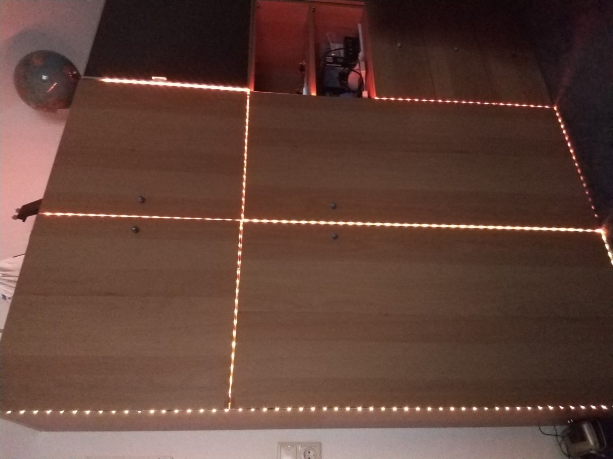

This project is based on the Telegram Bot Api project:


Always being fascinated by rgb-lights I wanted to have them all over my room. It started with putting them underneath the bed and now I even have led-strips on the dors of my closet.

Here is (a bad quality) image from the final result:



Trying to run 5V leds with a Raspberry pi worked surprisingly well. The pi supports 3.3V which is almost half of the needed voltage but it was enough to lighten up the leds. It worked fine but I wasn't happy with the brightness of the light and the white color seemed really yellowish.

I figured I should use an external power source with the needed voltage and current to power my led-stripes. That way I would have enough power and I wouldn't use all that power from my raspberry pi. Also connected to the Pi were a phone, keyboard, and an Ethernet cable. They all needed power too.

I had two options to be able to control the lights while they were on a different electrical circuit:

1. Using a relay
2. Using a transistor

The second option was the better one because I only have two or three relays but lots of transistors.

I started experimenting with the transistors that I got in my Arduino starter kid and with the bit of knowledge that I still had from previous experiences I was able to build a working circuit:


In the back was a NPN Pn2222 transistor connected to the led and two power sources. A small resistor was used for the direct LED current and a large resistor for the base current of the transistor.
With this setup I was facing again two problems:

1. The max supported current and voltage of the transistor were way to low so it overheated and I almost burned my fingers (at least when I forgot to put a resistor in between)
2. I had no idea how to scale up this circuit to support multiple LEDs

After trying out a few possibilities I ended up using this one and it worked perfectly:


Switching to Tip120 transistors I connected my circuit to the pi:


And after scaling up my project for a total of 4 LED stripes it looked like this:


In my setup I use two 12 volts DC power supplies with 3.5 ampere each and a USB 5 volts power supply that controls the other two LED-stripes.

Now that the hardware is covered and connected to the GPIO pins of my pi it is time to build the software.

Each LED-stripe contains four connections. One is for power and the other three are Ground connections for each of the three colors.
After sorting and assigning the GPIO pins it looked like this:

```py
#        r1, g1, b1,   r2, g2, b2  r3, g3, b3    r4, g4, b4
pins = [(17, 6, 27), (5, 26, 22), (15, 18, 14), (24, 25, 23)]
```

I used the 

```py
import RPi.GPIO as GPIO
```

module to control the pins of the pi.

In a bit of code I assign a PWM to each of the different colors and create a thread that is able to make fading effects. In short it looks something like this:

```py
def set_light(stripeIndex, colorIndex, alpha, hertz=100):
    if pwmThreads[stripeIndex][colorIndex] is not None:
        pwmThreads[stripeIndex][colorIndex].stop()
        pwmThreads[stripeIndex][colorIndex] = None
    _raw_set_light(stripeIndex, colorIndex, alpha, hertz)
def _raw_set_light(stripeIndex, colorIndex, alpha, hertz=100):
    pwm = pwms[stripeIndex][colorIndex]
    pwm.start(float(alpha)/2.55)
    pwm.ChangeFrequency(hertz)
```

The thread looks like this:

```py
class FadeColor(threading.Thread):
    def __init__(self, stripeIndex, colorIndex, duration):
        threading.Thread.__init__(self)
        self._running = True
        self.stripeIndex = stripeIndex
        self.colorIndex = colorIndex
        self.duration = duration
    def calculate_brightness_linear(self):
        return (self.brightness/16)**2
        
    def run(self):
        self.brightness = 0
        increasing = True
        while self._running:
            if self.brightness >= 255:
                increasing = False
            if self.brightness <= 10:
                increasing = True
            self.brightness += 1 if increasing else -1
            _raw_set_light(self.stripeIndex, self.colorIndex,
            self.calculate_brightness_linear())
            time.sleep(self.duration/255/2/1000)
    def change_duration(self, new_duration):
        self.duration = new_duration
    def change_brightness(self, new_brightness):
        self.brightness = new_brightness
    def stop(self):
        self._running = False
```

It takes a stripe index, a color index and a fade duration and then starts to smoothly turn on and off the LEDs.
Because brightness doesn't change linear I had to implement the calculate_brightness_linear function to calculate the correct brightness.

<!-- TODO -->