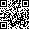

### This time I learnt how to decode a QR-Code

First you need a QR-Code:

This area is used for the camera to identify the bounds and rotation as well as some error stuff:

Then you need to determine the mask pattern from the red marked pixels and invert every pixel at a black position. In this case the mask is a checkerboard pattern. You can look up different masks at the [Wikipedia](https://en.wikipedia.org/wiki/QR_code).

It should look like this afterwards:

The data is encoded in 8-Bit chunks starting with a 4-Bit chunk in the lower right corner. The corner tells the way of encoding, in this case it is binary. The first Byte tells how long the message is. Afterwards the Bytes follow which can be decoded.

In this case it should be:

0100 00011100

01101000 01110100 01110100 01110000 01110011 00111010 00101111 00101111 01111001 01101111 01110101 01110100 01110101 00101110 01100010 01100101 00101111 01100100 01010001 01110111 00110100 01110111 00111001 01010111 01100111 01011000 01100011 01010001

0000

ending with the first occurrence of 0000.
This binary sequence can be decoded:

104 116 116 112 115 58 47 47 121 111 117 116 117 46 98 101 47 100 81 119 52 119 57 87 103 88 99 81

Further decoding can happen by using an Ascii-Table.

For a more detailed instruction on the different steps, read [this](https://en.wikipedia.org/wiki/QR_code) Wikipedia article.