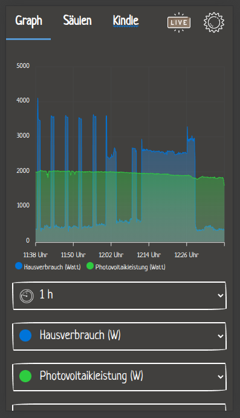
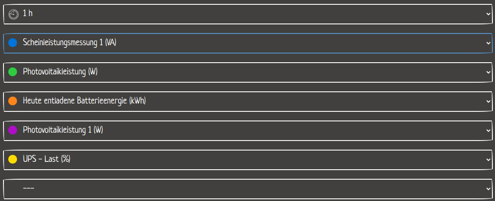

We got some new solar plants on our roof and they came with a WiFi connection out of the box.

Additionally to the WiFi connection, it also came with an API to get the production data.

Because of my general urge to touch anything in my house that has an API, I created a dashboard to monitor the production of the solar plants.

# Collecting data

The first thing I needed to do was to get the data from the API and store it somewhere.

The solar plants use a service called "goodwe" to monitor the production. Luckily, there is a Python library called `goodwe` that can be used to get the data.

So it was just as simple as installing the library, writing some janky Python code and running a new service on my Raspberry Pi.

```python
import asyncio
import goodwe

async def main():
    inverter = await goodwe.connect(ip_addess)
    runtime_data = await inverter.read_runtime_data()

# store the runtime data in a database...
```

The data was stored in a duckdb database, because I wanted to try it out and the internet said it was fast.

# Displaying the data

Using my go-to tech stack at the time (Svelte Frontend, Express Backend), I created a dashboard to display the data.



The charts are created using the `chart.js` library.

Because I really liked PaperCSS, I used it for the styling.

With the dropdowns you can select what data to show and the date range.

Using ChatGPT, I created a human readable description for each of the parameters given by the API.



And many more...

Because going to a website was too difficult for my parents, I also had a look at how to display the data on an Amazon Kindle.

For that I created a separate page that only shows the most important data in a visually appealing way. The page is optimized for the Kindle's resolution and on the kindle runs a script that updates the scrennshot every few minutes to display it without consuming lots of power.

Sadly, because of a bug in the kindle software, the kindle still used a lot of power and it had to be charged every few days, which was too much work and therefore the kindle idea was discarded after a few months.
