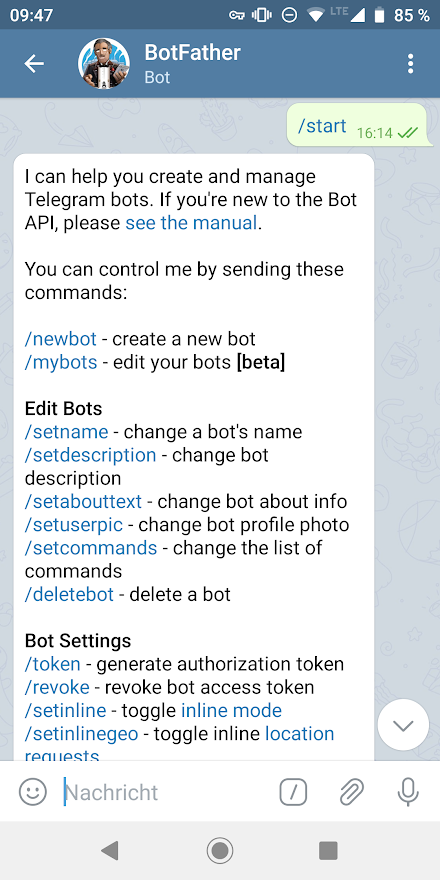

I wanted to be able to send messages from my phone to the Raspberry Pi. The easiest way would be to do this via some kind of app, maybe a messenger. That was when I discovered the Telegram Bot api. I also considered using WhatsApp or Threema but I didn't want my phone number to get blocked accidentally on WhatsApp if I messed something up and the Threema api seemed way to complicated because of all the encryption that has to happen.

Opening Telegram I had to write to the @BotFather:




After creating a /newBot I received a bot token. With that token I was able to make the api calls and receive messages that were sent to my bot.

Implementing the api in python was a simple task.

I modified the version that was recommended by Telegram a bit:

```py
import urllib
import json
import requests

TOKEN = '<THIS IS A SECRET TOKEN>'
URL = "https://api.telegram.org/bot{}/".format(TOKEN)

def get_url(url):
    """Gets the content of the Url in utf-8 format"""
    response = requests.get(url)
    content = response.content.decode("utf8")
    return content
def get_json_from_url(url):
    """Returns the repsonse of the url get request in a json format."""
    content = get_url(url)
    js = json.loads(content)
    return js
def get_updates(offset=None):
    """Gets all messages that haven't been processed yet."""
    url = URL + "getUpdates?timeout=100"
    if offset:
        url += "&offset={}".format(offset)
    js = get_json_from_url(url)
    return js
def get_last_update_id(updates):
    """Gets the id of the last message."""
    update_ids = []
    for update in updates["result"]:
        update_ids.append(int(update["update_id"]))
    return max(update_ids)
```

I also added my own function to send a message to a user:

```py
def send_message(text, chat_id):
    """Sends a message to the given chat"""
    try:
        text = urllib.parse.quote_plus(text)
        url = URL + "sendMessage?text={}&chat_id={}".format(text, chat_id)
        get_url(url)
    except Exception as e:
        print(str(e))
```

By running the get_updates check in a loop I was able to communicate with my pi:

```py
import http.client as httplib
import time

def process_new_messages(updates):
    """Processes the new messages on their content."""
    for update in updates["result"]:
        doSomethingWithMessage(update)
```

Here I check for new messages twice a second.

```py
def check_messages_loop():
    """Constantly checks for new messages for the telegram bot."""
    print('started!')
    last_update_id = None
    while True:
        updates = get_updates(last_update_id)
        if len(updates["result"]) > 0:
            last_update_id = get_last_update_id(updates) + 1
            process_new_messages(updates)
        time.sleep(0.5)
```

I am waiting for an Internet connection here because there is not Internet shortly after booting the pi.

```py
def wait_for_internet_connection():
    """Pauses the script until an internet connection is established."""
    while True:
        conn = httplib.HTTPConnection("www.google.com", timeout=5)
        try:
            print('trying connection')
            conn.request("HEAD", "/")
            conn.close()
            return
        except:
            conn.close()

wait_for_internet_connection()
check_messages_loop()
```

I surrounded everything with try and catch phrases (not included here) to make sure the script can run 24/7.

This project is the base for a few other projects I made.