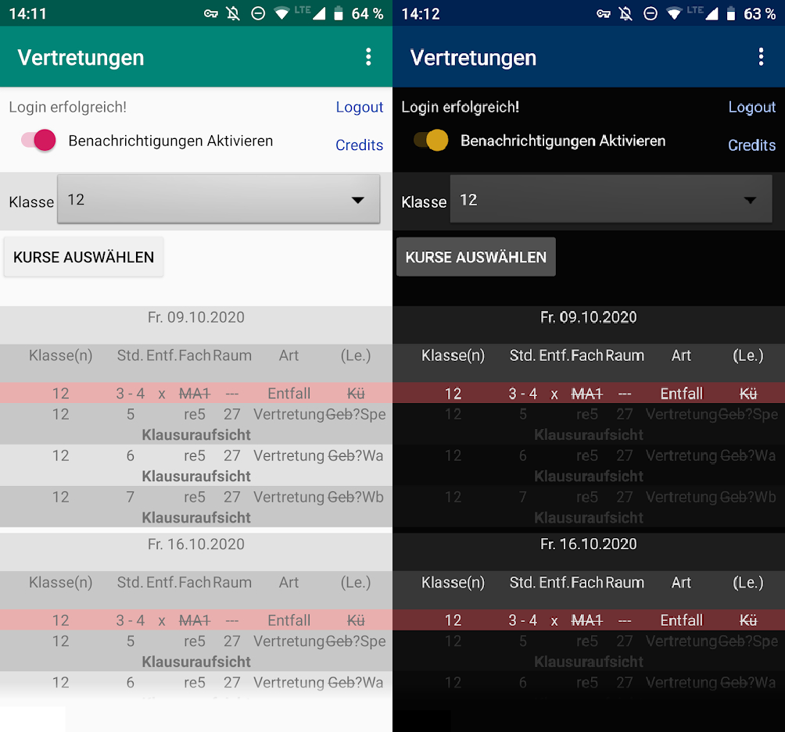
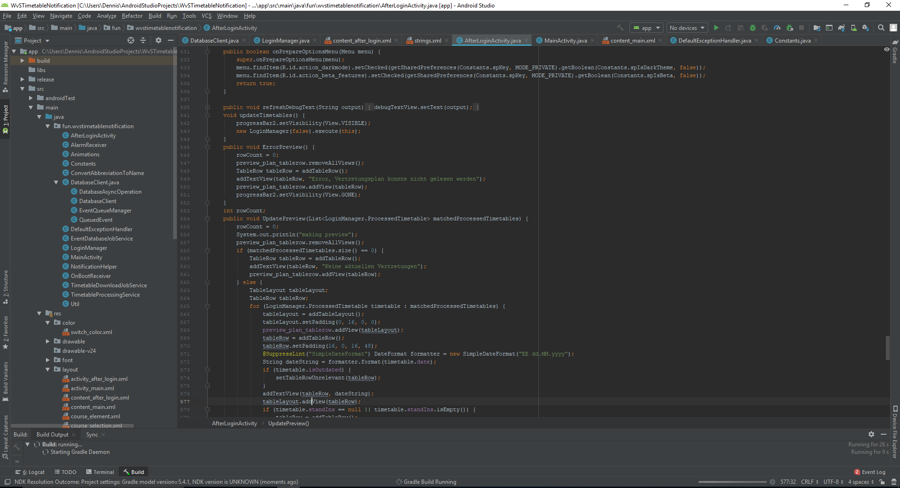

An app that notifies the user about specific stand ins and dismissed classes.  
(It is made in German, because I live in Germany)
  
The app we had for our timetable at school was already pretty good. But for me it was missing a very important feature. I wanted to get a notification on my phone whenever a new timetable was published by my school's director.  
Timetables would be updated every day at least once but the time was always a different one. Having to check for an update every hour manually was not a solution I would be comfortable with.  
So I coded an app myself that would send the notifications and even filter out the timetable of classes I didn't attend.  

## Using Java and Android Studio:
Using the native IDE for Android Apps I started to get comfortable with Android Studio. I spent multiple weeks fighting with Android's services and it's Wake Locks and manifest files. Trying to get my app to work in the background consistently was giving me a very hard time. Till now i have yet to figure out a way that works all the time because my service still doesn't always work at the exact time I want it to. As the project isn't dependent on perfect timing though it is fine the way it is now.  

## Java and web-scraping
The timetables get uploaded to the school's IServ. A student can access the timetables either via the IServ App or by using an Internet browser. He has to fill a login form first with his username and password. After doing so he can access the timetable.  
I used Jsoup to make a Post-Request to the server with the username and password as parameters.  

I then saved the cookies in a local file so that I didn't have to login with the password every time. Using these cookies I was able to download the raw timetable as an html document. Using Jsoup again I was able to extract the specific elements with the needed information.  

Html
  
Java
  
With some RegEx the scraped information is filtered according to the classes and teachers specified by the user. (See the first image of this post)

A friend of mine gave me the idea to add a dark mode as theme to my app. I liked that idea until I had to wrap my head around all the problems that come with wanting to change the style in Android Studio. If you know how to do it, it is probably really simple but it took me a long time to figure out.

The main part of my app though is the fact that it makes regular checks and sends a notification as soon as the timetable gets updated.
I haven't found a reliable solution yet. I tried to use the AlarmManager, the JobScheduler and the WorkManager but none of these really work reliably on all devices. Especially after uploading my app to the Google Play Store the alarms almost never get triggered when they should.
Ending up with using an AlarmManager in combination with a ForegroundService was the best solution I could find.
  
I wanted to be able to see what causes the problems on my friends devices. I tried to use Google Analytics first but it was way too much for my little project and though Google Analytics seems like a powerful tool, it wasn't what I was searching for.
The next tool I tried was Flurry Analytics but I had my problems with that tool as well.  
I ended up scripting my own event receiver tool using Tomcat and a Java Servlet. That project can be found here:  

The app also includes being started after booting the device:
  
It only works on Android because I didn't have the time (and especially the money) to develop it for Apple devices as well.